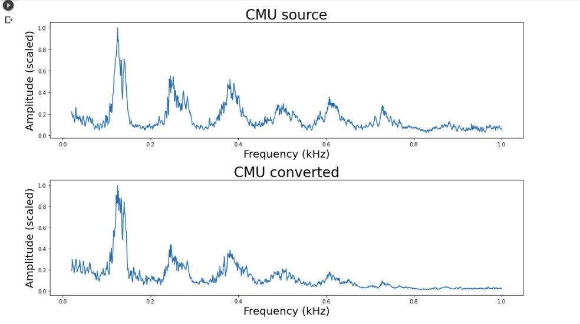
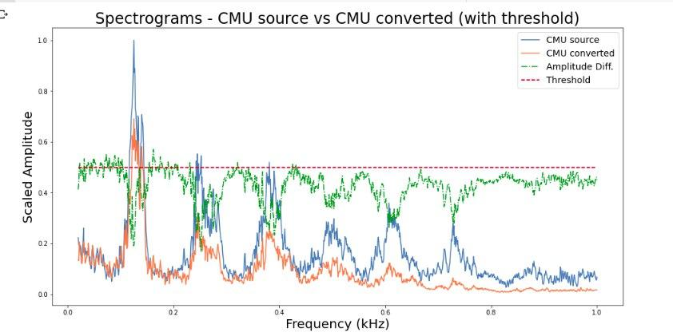
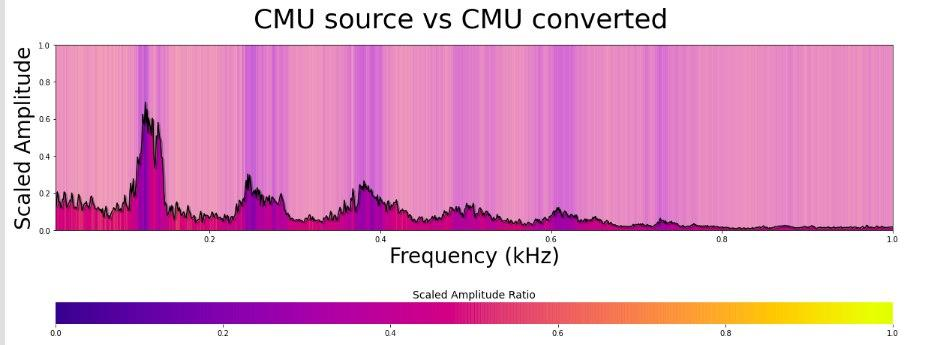

# Non Parallel Voice conversion using CycleGan-VC2

Converting voice from source to target speaker using a non-parallel dataset and cyclegan-vc2 architecture

## Datasets Used

- VCC 2016 --> [link](https://datashare.is.ed.ac.uk/handle/10283/3061)
- Malayalam Dataset from openslr --> [link](https://www.openslr.org/63/)
- CMU Arctic (Indian accented english and US english) --> [link](http://www.festvox.org/cmu_arctic/)

## Directory Structure

```
├── Pytorch-CycleGAN-VC2/
│   ├── cache/
│   └── data/
```

[cache](https://drive.google.com/drive/folders/1macCqh240bRFK5AuDAACeA-e04xDbI0X?usp=sharing) directory and [data](https://drive.google.com/drive/folders/1-fEeZSyq40h_KTi5DFu3b-M40Sl8WGde?usp=sharing) directory

**Understanding the directories**
- data directory
    - there is a directory for each dataset
    - inside each directory there would be subdirectories having voice samples and a *converted sound/converted* subdirectory
    - the converted_sound/converted subdirectory contains the set of target voice samples that have been converted by the model during validation
- cache directory
    - this directory contains the preprocessed data and respective models.
    - every dataset has their their own directory
    - each directory has a subdirectory named *model_checkpoint* that stores the model for that dataset
    - how to load a model for testing is given [here](README.md/#testvalidating)

## Usage

### Preprocess dataset for Training

Preprocess the wav files and store it in numpy format\
For example, if the source is `SF1` and target is `TF1`\
(or can change the defaults inside prepocess_training.py and run it without any arguments)
```
$ python prepocess_training.py --train_A_dir ../data/vcc2016_training/SF1
                                --train_B_dir ../data/vcc2016_training/TF1
                                --cache_folder ../cache/
```
### Training

If the source is `SF1` and target is `TF1`
```
$ python train.py --logf0s_normalization ../cache/logf0s_normalization.npz --mcep_normalization ../cache/mcep_normalization.npz --coded_sps_A_norm coded_sps_A_norm --coded_sps_B_norm coded_sps_B_norm --resume_training_at ../cache/model_checkpoint/_CycleGAN_CheckPoint --validation_A_dir ../data/vcc2016_training/evaluation_all/SF1/ --output_A_dir ../data/vcc2016_training/converted_sound/SF1 --validation_B_dir ../data/vcc2016_training/evaluation_all/TF1/ --output_B_dir ../data/vcc2016_training/converted_sound/TF1/

```
### Test/Validating

For example, to test for voice conversion between `SF1` and `TF1`:
```
$python test.py --logf0s_normalization ../cache/logf0s_normalization.npz --mcep_normalization ../cache/mcep_normalization.npz --test_A_dir ../data/vcc2016_training/evaluation_all/SF1/ --output_A_dir ../data/vcc2016_training/converted_sound/SF1 --model_checkpoint ./model/_CycleGAN_CheckPoint
```

### Analysis




## References
- T. Kaneko, H. Kameoka, K. Tanaka and N. Hojo, "Cyclegan-VC2: Improved Cyclegan-based Non-parallel Voice Conversion," ICASSP 2019 - 2019 IEEE International Conference on Acoustics, Speech and Signal Processing (ICASSP), Brighton, United Kingdom, 2019, pp. 6820-6824.
- https://github.com/bajibabu/CycleGAN-VC
- https://github.com/leimao/Voice_Converter_CycleGAN
- https://github.com/junyanz/pytorch-CycleGAN-and-pix2pix/
